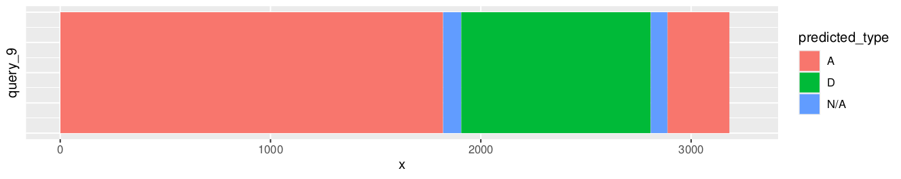
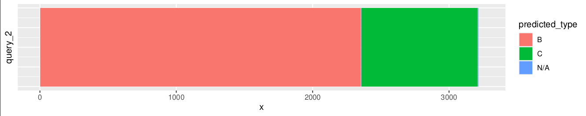

# SHERPAS

**Screening Historical Events of Recombination in a Phylogeny via Ancestral Sequences**

A new, alignment-free genome recombination detection tool exploiting the idea of phylo-kmers (originally developed in [RAPPAS](https://github.com/phylo42/RAPPAS), Linard et al. 2019) to accelerate the process by several orders of magnitude while keeping comparable accuracy. 

__Reference:__

Scholz GE, Linard B, Romashchenko N, Rivals E, Pardi F. [Rapid screening and detection of inter-type viral recombinants using phylo-k-mers.](https://academic.oup.com/bioinformatics/advance-article/doi/10.1093/bioinformatics/btaa1020/6040747) *Bioinformatics*

 - [Overview](#overview)
 - [Rapid Test](#rapid-test)
 - [Construction of a database](#construction-of-a-sherpas-phylo-kmer-database--pkdb-)
 - [SHERPAS Manual](#sherpas-manual)
   - [Mandatory options](#mandatory-options)
   - [Optional parameters](#optional-parameters)
   - [Advanced customization](#advanced-customization)
   - [Outputs](#outputs)
   - [Results visualisation](#results-visualisation)


# Overview

__Inputs:__
- A phylo-kmer database (__.rps__ extension) constructed from a reference alignment and tree (see below).
- A table associating each sequence in the reference alignment to a type (a.k.a. "strain"), in __csv__ format.
- A dataset of unaligned query sequences (e.g. whole genomes or long reads), in __fasta__ format.

__Outputs:__
- Table of recombination patterns detected in the query sequences.

# Rapid test

##Conda installation: (not recommended, for now)##

If you use conda (https://docs.conda.io/en/latest/), SHERPAS can be installed with:
```
conda install -c conda-forge -c bioconda sherpas
```

##Compilation from sources (recommended, for now)##

**Prerequisites:**
* Make sure Boost Librairies >=1.65 are present.
* Your GCC compiler must support C++17
* CMake >= 3.10 installed

In Debian, these can be installed with:
```
sudo apt install build-essential
sudo apt install cmake
sudo apt install libboost-all-dev
```

Clone the repository with recursive option, including submodules:
```shell
git clone --recurse-submodules git@github.com:phylo42/sherpas.git        #do not forget the --recurse-submodules !!!
```

Then, build SHERPAS:
```
cd sherpas
cmake -DCMAKE_POLICY_VERSION_MINIMUM=3.5 .   #do not forget the dot at the end !!!
make -j8
```

This will build three important binaries, make sure they are executable on your system:
```shell
sherpas/SHERPAS                    # SHERPAS' binary
lib/xpas/build/xpas-build-dna      # a binary to build a phylo-k-mer database using DNA sequences
lib/xpas/build/xpas-build-aa       # a binary to build a phylo-k-mer  database using Amino Acid sequences
```

We will now perform a recombination prediction for query HBV (Hepathitis B Virus) genomes sequences.

*If you used conda:*
```shell
# download a phylo-kmer database pre-built from HBV pure types from
# https://datadryad.org/downloads/file_stream/537187  => save pkDB-HBV-full.zip in current directory
unzip pkDB-HBV-full.zip
# download queries
wget https://raw.githubusercontent.com/phylo42/sherpas/master/examples/HBV_all/queries-3000.fasta
# launch a prediction for 3000 HBV queries, using the pre-built HBV database:
SHERPAS -d DB_k10_o1.5.rps -q queries-3000.fasta -o output -g ref-groups.csv -c
```
*If you built from sources:*
```shell
# download a phylo-kmer database pre-built from HBV pure types from
# https://datadryad.org/downloads/file_stream/537187  => save pkDB-HBV-full.zip in current directory
unzip pkDB-HBV-full.zip
# launch a prediction for 3000 HBV queries, using the pre-built HBV database
# queries were already downloaded (via your git clone)
sherpas/SHERPAS -d DB_k10_o1.5.rps -q ../examples/HBV_all/queries-3000.fasta -o output -g ref-groups.csv -c
```

The `DB_k10_o1.5.rps` file is an HBV phylo-k-mer database that we pre-computed (see detailed instructions below).
The `ref-groups.csv` file defines which genome belongs to which type (see detailed instructions below).

These 3000 queries should be analyzed in less than 5 minutes (using a 3Ghz i7 CPU).
After execution, you should obtain the following files in the `output` directory :

``` shell
# the results themselves, e.g a the list of recombinant regions detected for each query:
more res-queries-3000.txt 

# the queries in fasta format, matching the coordinates of res-queries-3000.txt 
more queries-3000-circ300.fasta
```


# Construction of a SHERPAS' phylo-kmer database (pkDB)

In the absence of a pre-computed pkDB, or to improve the available pkDBs for HIV and HBV, you will need to build your own database.

The construction of the pkDB is performed with [IPK](https://github.com/phylo42/IPK), a general tool to build phylo-k-mer databases.
For most viruses, we recommend using a value of *k* equal or superior to 10 (default in IPK is k=8).
This is because viral genomes are longer than typical markers used for phylogenetic placement (which is the standard use of [EPIK](https://github.com/phylo42/EPIK), another tool relying on IPK).

Also note that SHERPAS currently relies on an older release of IPK (which was previously codenamed XPAS).
The correct IPK release is targeted via the submodule in directory `/lib`, so you should not care about that if building from current repository.

Finally, while database construction is computationally heavy, it only needs to be performed once for a given reference alignment.
Guidelines specific to SHERPAS about this step are discussed in Sec. 2 of the [Supplementary Materials](https://www.biorxiv.org/content/biorxiv/early/2020/06/22/2020.06.22.161422/DC1/embed/media-1.pdf).


## Availability of pre-computed pkDBs

The phylo-kmer databases used in the SHERPAS manuscript can be downloaded from Dryad: [temporary link](https://datadryad.org/stash/share/nfeKF0waJCchScSeP1vhUbkYWinRJG_lcdSSub_BcCI) (large file: about 10 GB).
They can be used for recombination detection in whole-genome HIV and HBV sequences, and in HIV pol sequences. 
<!--- 
Final link should be one of:
https://datadryad.org/stash/downloads/file_stream/373882
https://doi.org/10.5061/dryad.r7sqv9s85
--->

## Preparing your own database

To use SHERPAS with your own viral model, you will need to prepare the following data:
* A multiple alignment of COMPLETE viral genomes. All genomes should be "pure" types, meaning that there should be no recombinant genomes in this dataset. Of course, this choice is arbitrary and relative to evolutionary time, as all sequenced genomes are likely recombinant of past types. But you aim is to obtain a clear segregation of your genomes "types" and to avoid misleading evolutionary signals. In all case, discard any genomes already known to be a recombinant of selected types.
* A phylogeny built from the alignment of selected complete genomes, using a maximum-likelihood reconstruction approach (e.g. any software : phyml, raxml, iq-tree...). Avoid distance-based reconstruction, such as NJ-based constructions.
* The `phyml` software must be installed and accessible via command-line (see instructions below). Recommended version is 3.3.20190909 from Bioconda, posterior version may work too.

### Example of database creation for HBV

Warning: Building your own database currently requires to build SHERPAS from sources.

Below is an example on how to build an HBV phylo-k-mer database, which will be necessary for future calls of SHERPAS.
```shell
# install phyml using conda
conda create -n phyml_3.3.20190909
conda activate phyml_3.3.20190909
conda install -c bioconda phyml=3.3.20190909

#the HBV genome alignment and corresponding tree are in the repo
# examples/database_build/HBV_alignment_mod.fas
# examples/database_build/HBV_tree.newick

# we will now build the phylo-k-mer database using the database construction binary corresponding to DNA (as alignment is DNA)
#launch this command from the top directory of the cloned repository
lib/xpas/build/xpas-build-dna --ar-binary $(which phyml) --refalign examples/database_build/HBV_alignment_mod.fas --reftree examples/database_build/HBV_tree.newick -k 8
```

Option `k` is the k-mer size. Default is k=8 for rapid tests, and here are some general recommendations :
* for recombination detection we recommend to set at least k=10, which should be OK for most viral species.
* longer k will require longer computations and will produce heavier databases, but prediction accuracy should increase.
* smaller k will result to fast computations but may produce less accurate predictions.
* if you genome alignment shows several regions full of gaps, longer k may be counterproductive as phylo-k-mer are hard to compute for these regions. Said otherwise, if your genome alignment is rich in gaps, keeping a lower k may be better.

# SHERPAS Manual

```shell
SHERPAS [options] 
```
Command-line options are the following (see detailed description below):

Option | Description | Default value
--- | --- | ---
**-d** | path to the phylo-kmer database | None (mandatory field)
**-g** | path to the strain-assignment file | None (mandatory field)
**-q** | path to the queries file | None (mandatory field)
**-o** | output directory | None (mandatory field)
**-w** | window size (>99)	 | 300
**-m** | method used (F or R) | F
**-t** | threshold for unassigned regions | 100 (F) or 0.99 (R)
**-c** | activates circularity options | None (none expected)
**-l** | changes output layout | None (none expected)
**-k** | disables N/A regions post treatment | None (none expected)
<!--- **-o** | path to the output directory | None (mandatory field) --->

## Mandatory options

**-d** : The path to the .rps file containing the phylo-kmer database. 
All the information on a reference alignment and the corresponding phylogeny used by SHERPAS are stored in this file. 
This file is either obtained from a trusted source (e.g. [availability of pre-computed pkDBs](#availability-of-pre-computed-pkdbs)) or
built by the user prior to using SHERPAS (with [RAPPAS2](https://github.com/phylo42/rappas2)). 
<!---
This building step only needs to be performed once for a given reference alignment
and a given kmer size k (note also that the database can independently be used with RAPPAS and SHERPAS).
--->

**-g** : The path to a .csv file that specifies the mapping between strains and sequences in the reference alignment.
This file consists of two columns, the first one containing the name of the sequences in the reference alignment (these names must match the names in the alignment file used to build the database), the second one the corresponding strains.
Neither the sequence names nor the strains names should contain a comma (‘,’). Moreover, strain names should not contain a star (‘*’).

*Example:*
```
ref_1,A
ref_2,A
ref_3,B
ref_4,C
```

**-q** : The path to a .fasta file of query sequences. The sequences in this dataset will be analyzed individually by SHERPAS, using the information in the two files specified by the two options above.

**-o** : The path to the output directory.
See section [Outputs](#outputs) below for details on the output format.
<!--- The path to the output directory, where the result files will be created. --->

## Optional parameters

The parameters below influence the behavior of SHERPAS both in terms of accuracy and running times.
We refer the user to the manuscript for a discussion of how the parameters below should be adjusted, 
depending on the different use cases for SHERPAS. 

**-w** : The size, in number of *k*-mers, of the sliding window (default value 300). 

The window size controls how easily SHERPAS switches between different strain classifications along the query. 
Smaller windows tend to produce more fragmented partitions of the queries, thus increasing the detection of short recombinant segments, but also that of false positive recombinants.
The minimum possible value is 100, and the maximum is the length in *k*-mers* of the shortest sequence in the query file.
(*The number of *k*-mers in a sequence of length *L* is *L*+1-*k*.) 
We advise against any value smaller than 200 or larger than 600. 

**-m** : The method used by SHERPAS (default value F). 

Currently two options are possible, “full” (called with F) and “reduced” (called with R). While “full” is usually more accurate, “reduced” is much faster.
Of the 3 optional parameters, this is the only one that has a significant influence on running times.

**-t** : The threshold controlling unassigned regions (default value 100 for method F and 0.99 for method R). 

A segment of a query can be returned as “unassigned” (N/A) if the evidence for any particular strain is too weak. This threshold governs the definition of “too weak”, with high thresholds generally producing larger unassigned regions, i.e. more conservative strain assignments. The precise meaning of this threshold depends on the chosen method: 
In method F, in order for a region to be assigned to a strain, the ratio of the best score over the second best score must be larger than the threshold. In method R, it is the ratio of the best score over the sum of all scores that must be larger than the threshold. 
<!---
For method F, the parameter controlled by the threshold is the ratio of the best score over the second best score, thus the threshold should be either zero or greater than one (any threshold between zero and one has the same effect as a threshold of zero). For method R, it is the ratio of the best score over the sum of all scores, so the threshold must be comprised between zero and one in that case (a threshold greater than one will return “unassigned” for the whole sequence, as the ratio computed is always smaller than one). For both methods, a threshold of zero means that no such control is operated.
--->

## Advanced customization

These are options that are disabled by default but may be useful in some circumstances.

**-c** : Use when queries are whole circular genomes.

**-l** : Changes the output mode to “linear” (see Output section below).

**-k** : Skips the post-processing part of unassigned segments.


##  Outputs

The results are written to a .tsv file with the following format.
Headers comments, that include analysis parameters, are preceded by #.

Then for each query, several lines indicate the name of the query (its fasta header), coordinates of a distinct sequence segment and the type to which it was assigned:
```
[query_identifier] \t [position_start] \t [position_end] [predicted_type] \n

```
The coordinates are 1-based and are relative to the query sequences without gaps. This is similar to the format used by [jpHMM](http://jphmm.gobics.de/), which facilitates comparisons.  

*Example:*
```
# SHERPAS output for queries "queries-3000"
#
# method: F; threshold: 100; window: 300
#
# circular genome
#

query   position_start  position_end    predicted_type
query_1 1       745     A
query_1 746     774     N/A
query_1 775     1334    D
query_1 1335    1352    N/A
query_1 1353    3221    A
query_2 1       1       N/A
query_2 2       2353    B
query_2 2354    2356    N/A
query_2 2357    3209    C
query_2 3210    3215    N/A
```

Alternatively (when option -l is activated), the output for one query is reduced to a single comma separated line, in the form:
```
0,[strain_1],[breakpoint_1],[strain_2],...,[breakpoint_n-1],[strain_n],[end_of_sequence_position]
```

*Example:*
```
>query_1
0,B,4594,A,7287,B,8663
```

## Results visualisation

We provide a small R script to generate a visual representation of the predicted recombination patterns.
This script is in `examples/display_results.R`, and it requires `ggplot2` library to be installed in your R setup.

Using the previous example, recombination pattern images can be built with this command:

**Warning**: default behaviour is to generate one pdf image per query ! Which could lead to thousands of images in one directory. Adapt the script as needed.
```bash
Rscript --vanilla examples/display_result.R output/res__queries-3000.tsv 
```

If we open the example of HBV query 9, we get this representation:


This query HBV genome (~3200bp long, coordinates on X axis), appears to be a recombinant of HBV type A (clear red) and type D (green). Here, recombination points remained hard to predict with confidence. They are located somewhere inside the N/A intervals (undefined type, in blue).

In the second example of HBV query 2, the recombination point is narrowed down to a much more reduced interval, the phylogenetic signal switch from one type to the other was stronger.


Finally, more complex recombination patterns can occur, as seen in the example of HBV query 6:


Here, it is unlikely that the very thin interval attributed to type E belongs to a real recombination event. This small "E" interval that is moreover bordered by long N/A interval should be interpreted as a region in which phylogenetic signal was hard to decipher. This small interval for type E should likely be seen as noise (maybe one of a few k-mer that matched by chance). 
Typically, in such case higher values of k may be helpful and refine the prediction (given that this region is not gappy, in which case improvement is unlikely).